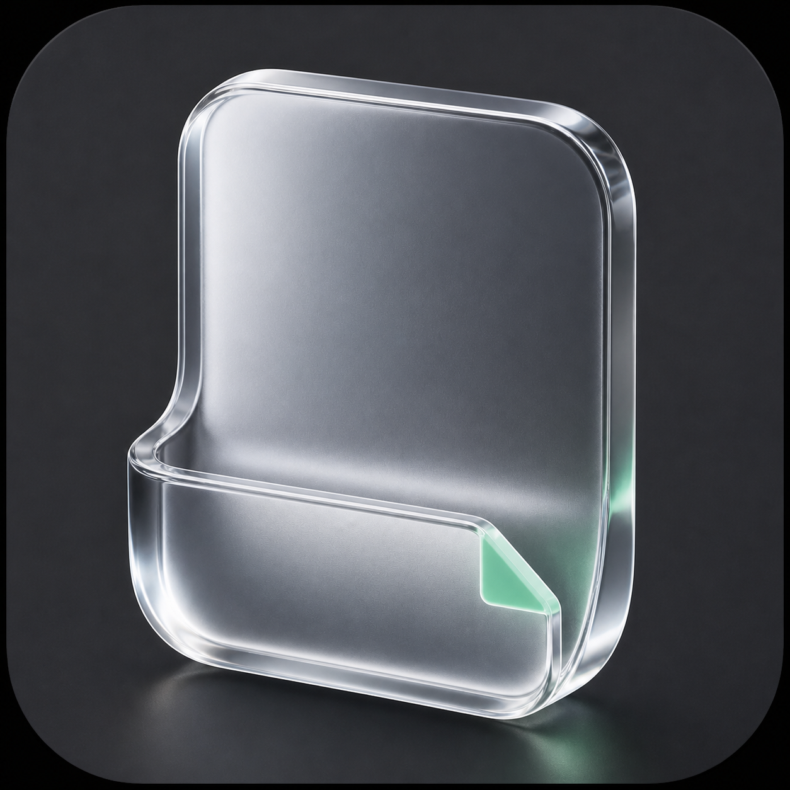

<p align="center">
  
</p>

<h1 align="center">ShelfDrop</h1>

<p align="center">
  ファイル、フォルダ、リンク、テキストを一時的に置いておける、小さなmacOS用フローティングシェルフ。
</p>

<p align="center">
  <a href="https://github.com/hayashiii-ghub/shelfdrop/releases/latest"></a>
  <a href="https://github.com/hayashiii-ghub/shelfdrop/actions/workflows/ci.yml"></a>
  
  
  <a href="LICENSE"></a>
</p>

<p align="center">
  <a href="https://shelfdrop-gamma.vercel.app"><strong>Webサイト</strong></a>
  ・
  <a href="https://github.com/hayashiii-ghub/shelfdrop/releases/latest/download/ShelfDrop-macos.zip"><strong>最新版をダウンロード</strong></a>
  ・
  <a href="https://github.com/hayashiii-ghub/shelfdrop/issues">Issue</a>
</p>

## ShelfDropとは

ShelfDropは、作業中のファイルを一時的にまとめて置くためのmacOSアプリです。Finderから別のアプリへ複数のファイルを移す時や、離れたフォルダ間でファイルを整理する時に、常に手前に表示される小さな棚として使えます。

Apple IDやMac App Storeを使わず、GitHub Releasesから直接ダウンロードできます。Apple Silicon MacとIntel Macの両方に対応しています。

## 主な機能

| 機能 | 操作 |
| --- | --- |
| Finderの選択項目を追加 | Finderで選択して`Option + Tab` |
| 棚の表示・非表示を切り替える | `Option + Shift + Tab` |
| 複数項目をまとめて取り出す | フッター左端のスタックアイコンをドラッグ |
| 項目を個別に取り出す | 棚の行をFinderや他のアプリへドラッグ |
| コピー・移動・ZIP化 | フッターの各アイコンから実行 |
| 開く・Finderで表示・コピー | 各行のボタンまたはコンテキストメニュー |
| 棚を移動 | ヘッダーをそのままドラッグ |
| 棚を隠す | `×`ボタンまたは`Escape` |

棚は表示後、閉じるまでほかのウィンドウより手前に残ります。棚内でのファイル名変更や並べ替えは行いません。

## 対応する項目

- 通常のファイルとフォルダ
- CSV、TXT、Markdown、HTML、JSON、PDF、SVG
- PNG、JPEGなどの画像
- 独自拡張子や拡張子のないファイル
- URLとプレーンテキスト

ファイル拡張子による制限は設けていません。アプリからファイル本体のデータだけが渡された場合も、元のファイル名と拡張子を保って一時保存します。

## インストール

1. [最新の`ShelfDrop-macos.zip`をダウンロード](https://github.com/hayashiii-ghub/shelfdrop/releases/latest/download/ShelfDrop-macos.zip)します。
2. ZIPを展開し、`ShelfDrop.app`を`アプリケーション`フォルダへ移動します。
3. 初回のみ、Finderで`ShelfDrop.app`をControlキーを押しながらクリックし、`開く`を選びます。

> [!NOTE]
> 配布版はad hoc署名で、Apple Developer IDによる署名とnotarizationは行っていません。そのため、初回起動時にmacOSの警告が表示される場合があります。

「壊れているため開けません」と表示される場合:

```sh
xattr -dr com.apple.quarantine /Applications/ShelfDrop.app
```

## 更新

ターミナルから最新版へ入れ替えられます。

```sh
curl -fsSL https://raw.githubusercontent.com/hayashiii-ghub/shelfdrop/main/script/install_latest.sh | bash
```

`/Applications`または`~/Applications`にある既存の`ShelfDrop.app`を検出して更新します。メニューバーの`Download Latest Version...`から最新版のダウンロードを開始することもできます。

## 権限

`Option + Tab`でFinderの選択項目を取得するため、初回利用時にmacOSからFinderの操作許可を求められます。Finderのファイルとフォルダは`Option + Tab`で追加し、リンク・画像・テキストはドラッグ＆ドロップでも追加できます。

## 開発

必要な環境:

- macOS 14以降
- Xcode Command Line Tools
- Swift 5.9以降

ビルドして起動:

```sh
./script/build_and_run.sh
```

テストとスクリプト検証:

```sh
make check
```

配布用ZIPを作成:

```sh
make package VERSION=v0.2.4
```

主なディレクトリ:

```text
Sources/ShelfDrop/    アプリ本体
Tests/ShelfDropTests/ テスト
Assets/               アプリ・メニューバーアイコン
script/               ビルド、配布、更新スクリプト
```

## コントリビューション

バグ報告と機能提案は[Issues](https://github.com/hayashiii-ghub/shelfdrop/issues)から受け付けています。Pull Requestを送る前に[CONTRIBUTING.md](CONTRIBUTING.md)を確認してください。

セキュリティ上の問題は公開Issueへ詳細を書かず、[SECURITY.md](SECURITY.md)の手順で報告してください。

## ライセンス

[MIT License](LICENSE)
